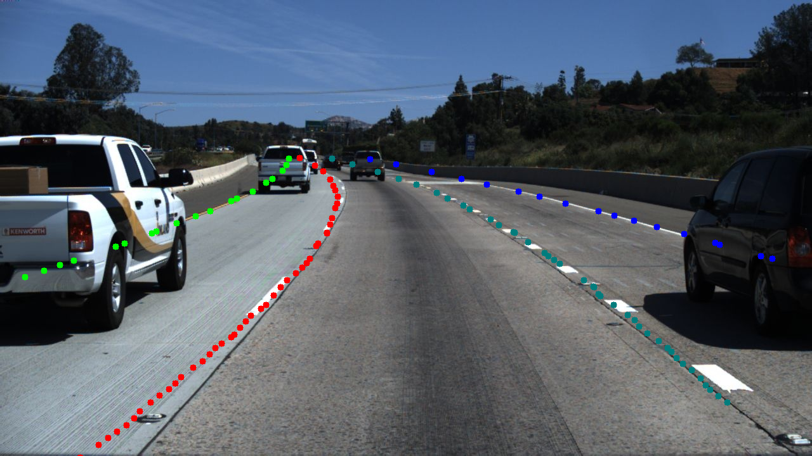
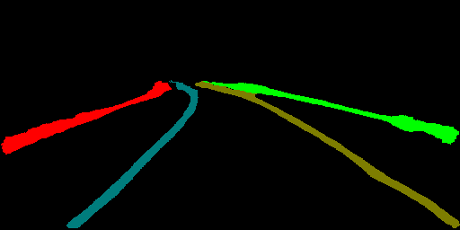

# LaneNet 模型使用教程

本教程旨在介绍如何通过使用LaneNet进行车道线检测。

Note: 本教程所有命令都基于当前目录`PaddleSeg/contrib/LaneNet/`下执行。

## 环境依赖

* PaddlePaddle >= 1.7.0 或develop版本
* Python 3.5+

通过以下命令安装python包依赖，请确保在该分支上至少执行过一次以下命令
```shell
$ pip install -r requirements.txt
```

## 一. 准备待训练数据

我们提前准备好了一份处理好的数据集，通过以下代码进行下载，该数据集由图森车道线检测数据集转换而来，你也可以在这个[页面](https://github.com/TuSimple/tusimple-benchmark/issues/3)下载原始数据集。

```shell
python dataset/download_tusimple.py
```

数据目录结构
```
LaneNet
|-- dataset
    |-- tusimple_lane_detection
        |-- training
            |-- gt_binary_image
            |-- gt_image
            |-- gt_instance_image
            |-- train_part.txt
            |-- val_part.txt
```
## 二. 下载预训练模型

下载[vgg预训练模型](https://paddle-imagenet-models-name.bj.bcebos.com/VGG16_pretrained.tar)，放在```pretrained_models```文件夹下并解压。


## 三. 准备配置

接着我们需要确定相关配置，从本教程的角度，配置分为三部分：

* 数据集
  * 训练集主目录
  * 训练集文件列表
  * 测试集文件列表
  * 评估集文件列表
* 预训练模型
  * 预训练模型名称
  * 预训练模型的backbone网络
  * 预训练模型路径
* 其他
  * 学习率
  * Batch大小
  * ...

在三者中，预训练模型的配置尤为重要，如果模型或者BACKBONE配置错误，会导致预训练的参数没有加载，进而影响收敛速度。预训练模型相关的配置如第二步所展示。

数据集的配置和数据路径有关，在本教程中，数据存放在`dataset/tusimple_lane_detection`中

其他配置则根据数据集和机器环境的情况进行调节，最终我们保存一个如下内容的yaml配置文件，存放路径为**configs/lanenet.yaml**

```yaml
# 数据集配置
DATASET: 
    DATA_DIR: "./dataset/tusimple_lane_detection"
    IMAGE_TYPE: "rgb"  # choice rgb or rgba
    NUM_CLASSES: 2
    TEST_FILE_LIST: "./dataset/tusimple_lane_detection/training/val_part.txt"
    TRAIN_FILE_LIST: "./dataset/tusimple_lane_detection/training/train_part.txt"
    VAL_FILE_LIST: "./dataset/tusimple_lane_detection/training/val_part.txt"
    SEPARATOR: " "

# 预训练模型配置
MODEL:
    MODEL_NAME: "lanenet"

# 其他配置
EVAL_CROP_SIZE: (512, 256) 
TRAIN_CROP_SIZE: (512, 256)
AUG: 
    AUG_METHOD: u"unpadding" # choice unpadding rangescaling and stepscaling
    FIX_RESIZE_SIZE: (512, 256) # (width, height), for unpadding
    MIRROR: False
    RICH_CROP: 
        ENABLE: False 
BATCH_SIZE: 4
TEST:
    TEST_MODEL: "./saved_model/lanenet/final/"
TRAIN:
    MODEL_SAVE_DIR: "./saved_model/lanenet/"
    PRETRAINED_MODEL_DIR: "./pretrained_models/VGG16_pretrained"
    SNAPSHOT_EPOCH: 5
SOLVER:
    NUM_EPOCHS: 100
    LR: 0.0005
    LR_POLICY: "poly"
    OPTIMIZER: "sgd"
    WEIGHT_DECAY: 0.001
```


## 五. 开始训练

使用下述命令启动训练

```shell
CUDA_VISIBLE_DEVICES=0 python -u train.py --cfg configs/lanenet.yaml --use_gpu --do_eval
```

## 六. 进行评估

模型训练完成，使用下述命令启动评估

```shell
CUDA_VISIBLE_DEVICES=0 python -u eval.py --cfg configs/lanenet.yaml --use_gpu 
```

## 七. 可视化
需要先下载一个车前视角和鸟瞰图视角转换所需文件，点击[链接](https://paddleseg.bj.bcebos.com/resources/tusimple_ipm_remap.tar)，下载后放在```./utils```下并解压。同时我们提供了一个训练好的模型，点击[链接](https://paddleseg.bj.bcebos.com/models/lanenet_vgg_tusimple.tar)，下载后放在```./pretrained_models/```下并解压，使用如下命令进行可视化
```shell
CUDA_VISIBLE_DEVICES=0 python -u vis.py --cfg configs/lanenet.yaml --use_gpu --vis_dir vis_result \
TEST.TEST_MODEL pretrained_models/LaneNet_vgg_tusimple/
```

可视化结果示例：
  
 （1）预测结果：<br/>
  
 （2）语义分割结果：<br/>
  <br/>
 （3）实例分割结果：<br/>
  


